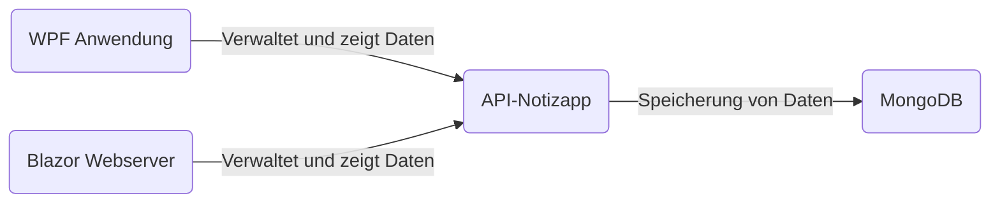
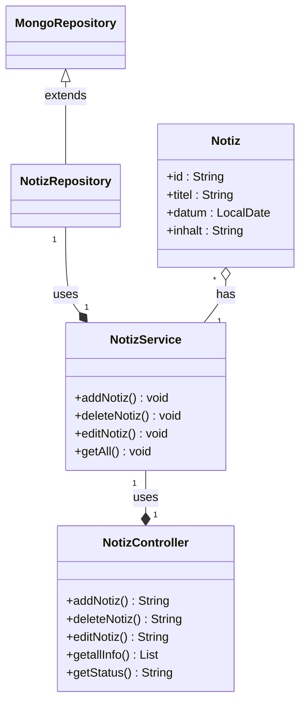

# Notizapp

Im Rahmen des Faches Prgrammieren und Softwareentwicklung musste ein Projekt, dass sich auf das Thema der REST-APIs konzentriert. Ein wichtiger Aspekt des Projekts war die Erstellung von zwei Clients, die auf diese API zugreifen. Die beiden Clients wurden als eine WPF-Anwendung und eine Website umgesetzt.

Das Projekt ist eine API, die eine einfache Notiz-App implementiert. Mit dieser sollte es möglich sein, Notizen die sich der Benutzer macht zu speichern und zugänglich zu machen.

<br>

## Inhaltsverzeichnis

- [Softwaredesign](#softwaredesign)
- [Softwarebeschreibung](#softwarebeschreibung)
- [API-Beschreibung](#api-beschreibung)
- [Diagramme](#diagramme)
- [Diskussion](#diskussion)

<br>
<br>


## Softwaredesign




<br>

#### API-Notizapp

Die API-Notizapp ist der wichtigste Teil des Projektes welche alle Daten mittels einer MongoDB-Datenbank speichert und verwaltet. Sie ist im Gegensatz zum Webbrowser und der WPF Anwendung als einzige in Java programmiert und basiert auf dem Spring Boot Framework.

#### Blazor Webserver

Ist eine einfach gestaltete Website mit der Benutzer ihre Notizen, welche von der API-Notizapp bereitgestellt werden, erstellen, bearbeiten oder löschen können. Die Website basiert auf das Webframework Blazor, dass auf ASP.NET aufgebaut ist. 

#### WPF Anwendung

Die WPF Anwendung dient wie der Webserver als Verwaltungsprogramm der gespeicherten Notizen. Auch hier, kann der Benutzer seine Notizen, die von der API-Notizapp zur Verfügung gestellt werden, erstellen, bearbeiten oder löschen.

<br>
<br>

## Softwarebeschreibung

#### API-Notizapp

Für die API wurden folgende Dependencies verwendet:
- spring-boot-starter-data-mongodb
- spring-boot-start-web
- spring-boot-starter-test

``` xml
<dependencies>  
    <dependency>        <groupId>org.springframework.boot</groupId>  
        <artifactId>spring-boot-starter-data-mongodb</artifactId>  
    </dependency>    <dependency>        <groupId>org.springframework.boot</groupId>  
        <artifactId>spring-boot-starter-web</artifactId>  
    </dependency>  
    <dependency>        <groupId>org.springframework.boot</groupId>  
        <artifactId>spring-boot-starter-test</artifactId>  
        <scope>test</scope>  
    </dependency></dependencies>
```

<br>

#### Endpoints konfigurieren

Um mit Daten zu speichern, ändern oder zu löschen braucht man sogenannte Endpoints mit den speziellen Anforderungen. Diese muss man zuerst in der API konfigurieren:

```java
@RequestMapping(method = RequestMethod.GET, value = "/Notiz")  
public List<Notiz> getallInfo() {return notizService.getAll();}
```

<br>
Die Endpoints werden unter dem Punkt API Beschreibung näher erläutert.

<br>
<br>

#### Blazor Webserver

Es werden nun die Codeteile die mit der API in Verbindung stehen erklärt und gezeigt.

Der folgende Codeabschnitt zeigt, wie die Daten mittels GET-Request an die API geholt und in eine Liste von Notizen gespeichert werden. Diese Liste wird dazu benutzt die Daten anzuzeigen und wird im späteren Verlauf für das löschen und bearbeiten von Notizen verwendet. 
Außerdem beinhaltet der Codeabschnitt die Konvertierung der übergebenen JSON-Objekte zu C#-Objekte. Dafür wurden die Methoden des Newtonsoft Json.NET Nugets verwendet.
Auf dieser Grundlage, bauen die POST-/ PUT-/ DELETE-Funktionen auf.

```c#
protected override async Task OnInitializedAsync()
    {
        HttpClient client = new HttpClient();

        string data = client.GetStringAsync("http://localhost:4000/Notiz").Result;
        notizen = JsonSerializer.Deserialize<List<Notiz>>(data);
    }
```

<br>
Der Funktionsaufruf  ```OnInitializedAsync()``` ist ein Teil des Blazor Frameworks und wird bei der Initialisierung der Seite aufgerufen.

<br>
<br>

Nun werden die Codeteile des Webservers worin die POST-/ PUT-/ DELETE-Requests enthalten sind gezeigt. Diese Funktionen ähneln sich mit den Funktionen der WPF Anwendung.
<br>

##### POST-Funktion
```c#
private void createNotiz()
    {
        notizen.Add(notiz);

        HttpClient client = new HttpClient();

        var noteJson = JsonSerializer.Serialize(notiz);
        var requestContent = new StringContent(noteJson, Encoding.UTF8, "application/json");
        client.PostAsync("http://localhost:4000/addNotiz", requestContent);

        notiz.title = "";
        notiz.inhalt = "";
    }
```
Hier wird eine neue Notiz erstellt und in die Liste der notizen, die man mittels GET-Request bekommt, gespeichert. Anschließend wird die Notiz in ein JSON-Objekt umgewandelt und per POST-Request an die API gesendet und in die MongoDB gespeichert.
<br>

##### PUT-Funktion
```c#
public void editNotiz()
    {
        HttpClient client = new HttpClient();


        var noteJson = JsonSerializer.Serialize(notiz);
        var requestContent = new StringContent(noteJson, Encoding.UTF8, "application/json");
        client.PutAsync("http://localhost:4000/editNotiz/" + notiz.id, requestContent);

        edit = false;
    }
```
Bei der PUT-Funktion wird wie bei der POST-Funktion die Notiz in ein JSON-Format umgewandelt und mittels PUT-Request and die API gesendet. Bei dem PUT-Request wird dabei die id mitgegeben, sodass die gewünschte Notiz durch die bearbeitete Notiz in der MongoDB ersetzt wird.
<br>

##### DELETE-Funktion
```c#
public void DeleteNotes(Notiz n)
    {
        HttpClient client = new HttpClient();
        client.DeleteAsync("http://localhost:4000/deleteNotiz/" + n.id);
    }
```
Die DELETE-Funktion löscht mittels DELETE-Request die angegebene Notiz. Dabei wird wie bei dem PUT-Request die id mitgegeben, sodass die gewünschte Notiz in der MongoDB gelöscht wird.
<br>
<br>

#### WPF Anwendung

Die WPF Anwendung ähnelt den Funktionen des Blazor Webservers. Sie ist auch in C# implementiert und die Methoden des Newtonsoft Json.NET Nugets verwendet. In der Speicherung in die MongoDB besteht jedoch ein kleiner unterschied.

Um die Daten zu holen wird nicht ``` JsonSerializer.Deserialize<List<Notiz>>(data);``` verwendet, da es aus unerklärlichen Gründen eine leere Liste zurückgibt. Dieses Problem trat aber nicht am Blalzor Webserver auf, deshalb wurde es wie schon vorher dokumentiert, anders implementiert.

``` c#
	HttpClient client = new HttpClient();

	string data = client.GetStringAsync("http://localhost:4000/Notiz").Result;
	notes = JsonConvert.DeserializeObject<List<Note>>(data);
```

<br>
Das selbe Problem trat auch bei den POST- / PUT- / und DELETE-Requests auf.

Die POST-/ und PUT-Methoden unterscheiden sich auch ein wenig zu den am Webserver. Hier wird die Notiz nicht wie am Webserver in ein json-Objekt umgewandelt, sondern ein neues json-Objekt mit den inhalt der Notiz erstellt und dem POST-/ und PUT-Request mitgesendet.
Der Grund für diese Art der Speicherung war, dass es sonst, mit der Speicherart wie beim Webserver, einen Datenbank Eintrag mit nur ```null``` Werten eingefügt wurde.

``` c#
    List<Note> notes = new List<Note>();

    JObject json = new JObject
    {
            { "title", titleBox.Text },
            { "inhalt", inhaltBox.Text },
    };

    HttpClient client = new HttpClient();

    string data = client.GetStringAsync("http://localhost:4000/Notiz").Result;
    notes = JsonConvert.DeserializeObject<List<Note>>(data);

    var requestContent = new StringContent(json.ToString(), Encoding.UTF8, "application/json");

    if (notes.Find(x => x.Id == note.Id) != null)
    {
        client.PutAsync("http://localhost:4000/editNotiz/" + note.Id, requestContent);
    }
    else
    {
        client.PostAsync("http://localhost:4000/addNotiz", requestContent);
    }
```

<br>
<br>

## API-Beschreibung

#### Notiz

<details>

 <summary><code>GET</code> <code><b>/Notiz</b></code> <code>(Gibt alle Notizen zurück)</code></summary>

  

##### Parameters

  

> | data type      | type         | format                  | description                                                   |
> |----------------|--------------|-------------------------|---------------------------------------------------------------|
> | None          | -  | -   | N/A  |

  
  

##### Responses

  

> |content-type             | response example / description                                                                |
> |-------------------------|-----------------------------------------------------------------------------------------------|
> |`json string`       | `JSON Liste an Notizen`                                              |

  
  

</details>
<details>

 <summary><code>POST</code> <code><b>/addNotiz</b></code> <code>(Fügt eine Notiz hinzu)</code></summary>

  

##### Parameters

  

> | data type      | type         | format                  | description                                                   |
> |----------------|--------------|-------------------------|---------------------------------------------------------------|
> | Notiz          | Requestbody  | object (JSON or YAML)   | N/A  |

  
  

##### Responses

  

> |content-type             | response example / description                                                                |
> |-------------------------|-----------------------------------------------------------------------------|
> |`json string`       | `{"success":"true","message":"Notiz has been added successfully."}`                |

  
  

</details>
<details>

 <summary><code>DELETE</code> <code><b>/deleteNotiz/{id}</b></code> <code>(Löscht eine Notiz)</code></summary>

  

##### Parameters

  

> | data type      | type         | format                  | description                                                   |
> |----------------|--------------|-------------------------|---------------------------------------------------------------|
> | String          | Path  | String   | {id} der gewünschten Notiz  |

  
  

##### Responses

  

> |content-type             | response example / description                                                                |
> |-------------------------|-----------------------------------------------------------------------------------------------|
> |`json string`       | `{"success":"true","message":"Notiz has been deleted successfully."}`                                              |

  
  

</details>
<details>

 <summary><code>PUT</code> <code><b>/editNotiz/{id}</b></code> <code>(Bearbeitet eine Notiz)</code></summary>

  

##### Parameters

  

> | data type      | type         | format                  | description                                                   |
> |----------------|--------------|-------------------------|---------------------------------------------------------------|
> | String          | Path  | String   | {id} der gewünschten Notiz  |
> | Notiz | Requestbody | object (JSON or YAML) | N/A |  

  
  

##### Responses

  

> |content-type             | response example / description                                                                |
> |-----------------------|-------------------------------------------------------------------------------|
> |`json string`              | `{"success":"true","message":"Notiz has been edited successfully."}`        |

  

</details>

#### API

<details>

 <summary><code>GET</code> <code><b>/status</b></code> <code>(Gibt den Status der API zurück)</code></summary>

  

##### Parameters

  

> | data type      | type         | format                  | description                                                   |
> |----------------|--------------|-------------------------|---------------------------------------------------------------|
> | None          | -  | -   | N/A  |

  
  

##### Responses

  

> |content-type             | response example / description                                                                |
> |-------------------------|-----------------------------------------------------------------------------------------------|
> |`json string`       | `{"success":"true","message":"Das Service ist verfügbar!"}`  |

  

</details>

#### Datentypen der Notiz

> | Datentyp | Name | Beschreibung | Required |
> |----------------|--------------|-----------------------|--------------|
> | String          | id  | uniqe, automatisch generiert   | no  |
> | String          | title  | Titel der Notiz   | no  |
> | LocalDate          | datum  | Erstell/Änderungsdatum   | no  |
> | String          | inhalt  | Inhalt der Notiz   | no  |

<br>
<br>

## Diagramme

Das folgende UML-Klassendiagramm zeigt die Beziehungen und Eigenschaften der Datentypen, mit welchen die API-Notizapp arbeitet.



<br>
<br>

## Diskussion

Das Projektende resultiert in 3 seperate Programme der REST-API, der WPF Anwendung und der Webapp. Alle 3 bilden in Zusammenarbeit ein einfaches Client-Server System, wobei die API der Server und die WPF und Webapp die Clients sind. Die API ist eine einfache REST-API die Daten über Notizen speichert und verwaltet. Die Aufgabe der beiden Clients ist es, Notizen zu erstellen, bearbeiten und zu löschen und diese anschließend in die MongoDB über die API zu speichern.

Die Erarbeitung des Projektes verlief recht holprig, da ich am Anfang des Projektes auf verschiedene Probleme stieß. Jedoch wurden diese Probleme entweder behoben oder es wurde ein neuer programmatischer Ansatz verwendet. Eine dieser Probleme war wie schon erwähnt die Speicherung der Daten in der WPF Anwendung, aber auch das fehlende Know-how bezüglich der Blazor Webapp. Durch ausreichender Recherche im Internet waren diese Probleme schnell gelöst. Positive Eigenschaften am Projektverlauf waren aufjedenfall das Wissen über WPF und Spring Boot, welches ich sowohl aus dem Unterricht als auch auch aus der Erarbeitung von verschiedenen Projekten in SYP mitnahm. Im Großen und Ganzen war es ein erfolgreiches Projekt, in welchem ich sehr viel dazugelernt habe.
